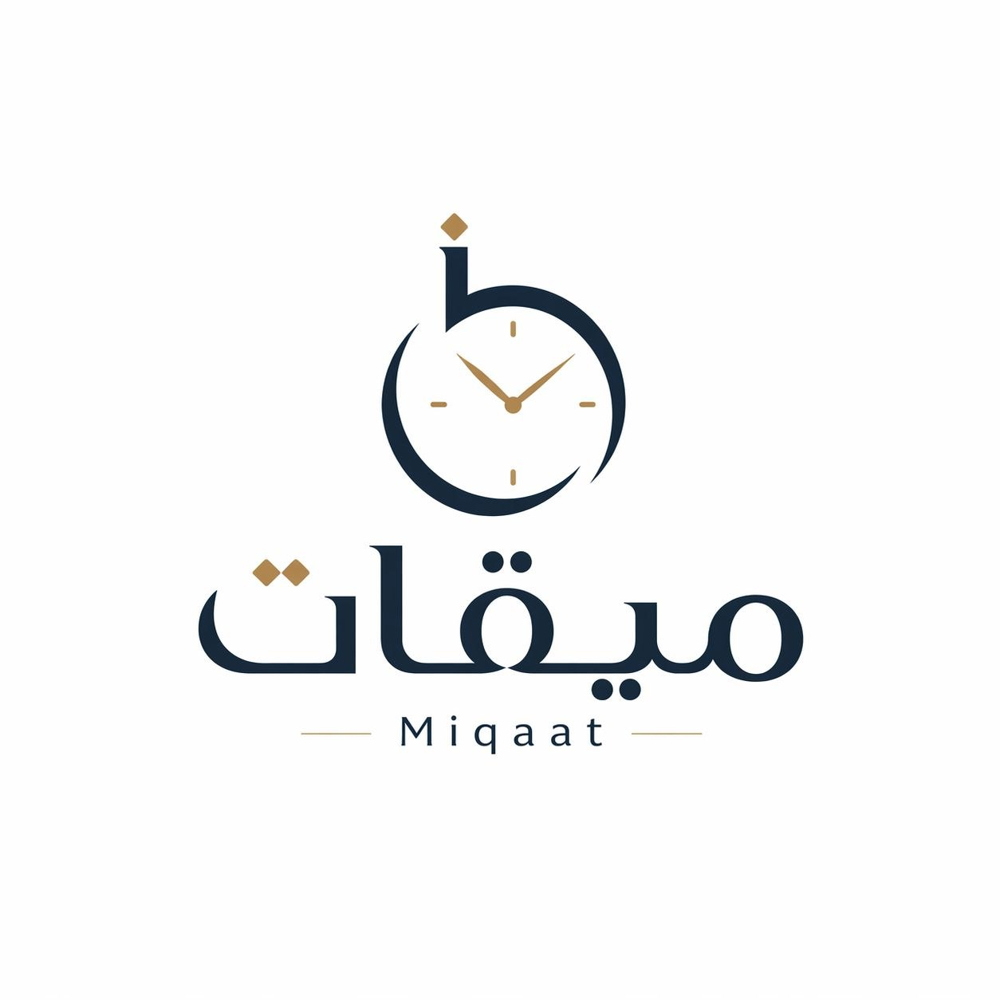
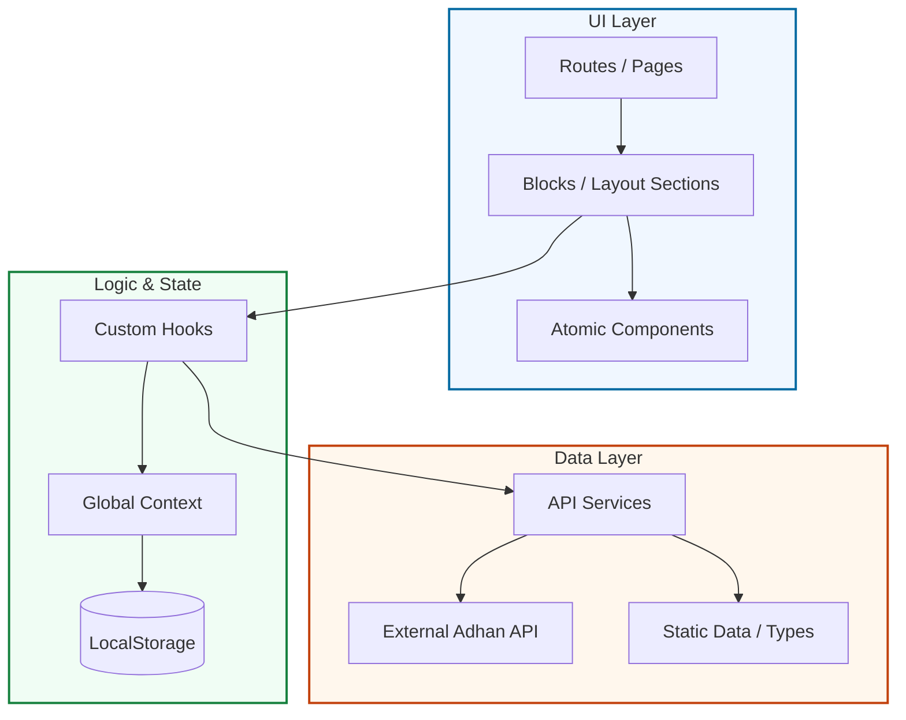

# 🌙 ميقات | Miqaat
> Accurate prayer times for Algerian Wilayas with a premium, modern experience.

[](https://react.dev/)
[](https://www.typescriptlang.org/)
[](https://developer.mozilla.org/en-US/docs/Web/CSS)
[](https://tailwindcss.com/)
[](https://reactrouter.com/)

<p align="center">
  
</p>

<p align="center">
  <a href="#-overview">Overview</a> •
  <a href="#-live-demo">Live Demo</a> •
  <a href="#-key-features">Key Features</a> •
  <a href="#-screenshots">Screenshots</a> •
  <a href="#-tech-stack">Tech Stack</a> •
  <a href="#-getting-started">Getting Started</a>
</p>

## ✨ Overview
**Miqaat** is a web application designed to provide accurate prayer times specifically for users in Algeria. Unlike generic apps, Miqaat is tailored to the Algerian calculation methods and offers a seamless, high-performance experience across all devices.

## 🌐 Live Demo
[View App](https://miqaat-eight.vercel.app/)

## 🚀 Key Features
*   📍 **Dynamic Location Selection**: Easily choose your Wilaya using an interface or by using automatic GPS detection.
*   ⏳ **Live Countdown**: Real-time updates and countdowns to the next prayer time.
*   📅 **Comprehensive Calendar**: View weekly and monthly prayer schedules with an elegant, printable layout.
*   🌓 **Dark Mode Support**: Fully responsive design that adapts to your system preferences.
*   🔔 **Smart Notifications**: Frontend-scheduled notifications firing 1 minute before each prayer.
*   📲 **PWA-ready Architecture**: Designed for future offline support and mobile installability.

## 📸 Screenshots

### 🏠 Home Dashboard
Comprehensive view of current and upcoming prayer times with a live clock.
<p align="center">
  
</p>

### 📍 Location Selection
A high-contrast, premium interface for choosing your location via list or GPS.
<p align="center">
  
</p>

### 🗓️ Prayer Calendar
Detailed weekly/monthly views with a clean, organized layout.
<p align="center">
  
</p>

## 🛠️ Tech Stack
*   **Frontend**: React (React Router v7)
*   **Language**: TypeScript
*   **Styling**:
    - **Tailwind CSS** (utility-first)
    - **Custom CSS** (design tokens, shimmer animations, theming system)
*   **Icons**: Lucide React
*   **Persistence**: LocalStorage for user preferences
*   **Deployment**: Optimized production build via Vite

## 💎 Design System
Miqaat is built on a custom design system that ensures visual consistency and a premium user experience.

| Token Category | Implementation |
| :--- | :--- |
| **Typography** | `Changa` (Arabic Brand), `DM Sans` (Body), `Cormorant Garamond` (Display) |
| **Color Palette** | Deep Algerian Indigo (`#1A5276`) & Luxurious Gold (`#C9A84C`) |
| **Visual Effects** | Glassmorphism, Shimmering Skeletons, and Custom Glow Shadows |


## 🏗️ Project Architecture
The project follows a modular and scalable architecture, separating UI concerns from business logic and data fetching.

### 🧩 System Overview


### 📁 Directory Breakdown
*   **`app/routes/`**: Entry points for each page (Home, Settings, Calendar, Location).
*   **`app/blocks/`**: Complex, layout-specific sections (e.g., Prayer Grid, Search Header) that compose pages.
*   **`app/components/`**: Reusable atomic UI elements (Buttons, Inputs, Skeletons) following a consistent design system.
*   **`app/hooks/`**: Encapsulated business logic (GPS tracking, prayer time calculations, countdown timers).
*   **`app/context/`**: Global state management using React Context for user preferences and location data.
*   **`app/services/`**: Data fetching layer and API clients for external communication.
*   **`app/data/`**: Static configuration, types, and constants.
*   **`app/i18n/`**: Localization dictionary and logic for Arabic/English support.


## 🔌 API Integration
Miqaat leverages the [Adhan DZ API](https://adhan-dz.dexter21767.com) to provide accurate, real-time data specifically for Algeria.

### Data Fetching
*   **Source**: [adhan-dz.dexter21767.com](https://adhan-dz.dexter21767.com)
*   **Endpoints**:
    - `/cities`: Fetches a comprehensive list of Algerian Wilayas and Baladiyas.
    - `/prayerTimes`: Retrieves daily or monthly prayer schedules based on the selected city ID and date range.
*   **Implementation**: Logic is centralized in [prayerApi.ts](file:///home/haroune-dev/Desktop/Miqaat/app/services/prayerApi.ts) (raw fetch layer) and [api.ts](file:///home/haroune-dev/Desktop/Miqaat/app/services/api.ts) (application mapping).

### Key Features
*   **Dynamic Data**: Times are fetched dynamically based on the user's selected location.
*   **State Sync**: Custom hooks (`usePrayerTimes`) handle loading states, error reporting, and real-time synchronization with the application context.


## 🏁 Getting Started

### Prerequisites
*   Node.js (LTS version recommended)
*   npm or yarn

### Installation
1. Clone the repository:
   ```bash
   git clone https://github.com/Haroune-dev/miqaat.git
   ```
2. Install dependencies:
   ```bash
   npm install
   ```
3. Start the development server:
   ```bash
   npm run dev
   ```

## 🌟 Project Highlights
*   **Zero Layout Shift**: Optimized loading skeletons for a premium first-load experience.
*   **RTL/LTR Support**: Fully localized interface for Arabic and English users.
*   **Performance**: Lightweight bundle with optimized asset delivery.

## 🔮 Future Improvements
*   [ ] Full Offline Data Persistence (Service Worker).
*   [ ] Support for Baladiyas (Sub-provinces).
*   [ ] Multi-language Expansion (French support).
*   [ ] Advanced Analytics & Insights.

## 👤 Author
**Haroune-dev**

---
